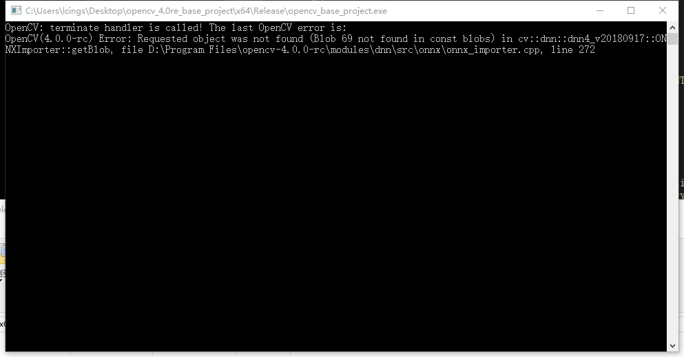
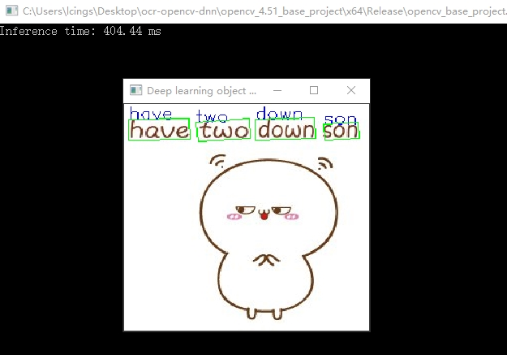

#### 0x00:opencv c++ ocr, base on tensorflow && onnx && vs2015
#### 0x01:note:

AST模型的下载：https://www.dropbox.com/s/r2ingd0l3zt8hxs/frozen_east_text_detection.tar.gz?dl=1

crnn的模型下载：https://drive.google.com/drive/folders/1cTbQ3nuZG-EKWak6emD_s8_hHXWz7lAr

CRNN_VGG_BiLSTM_CTC.onnx和frozen_east_text_detection.pb已下载好

位于\opencv_4.51_base_project\x64\Release目录下

注意：

cpp代码用opencv_4.51编译是没问题的，其它版本运行(可能)时会报如下的模型解析失败错误：

#### 0x02:result:
正常运行结果:

#### 0x03:reference
https://github.com/hpc203/ocr-opencv-dnn